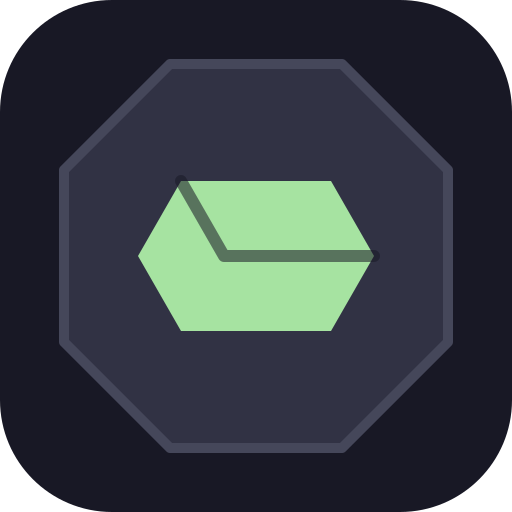
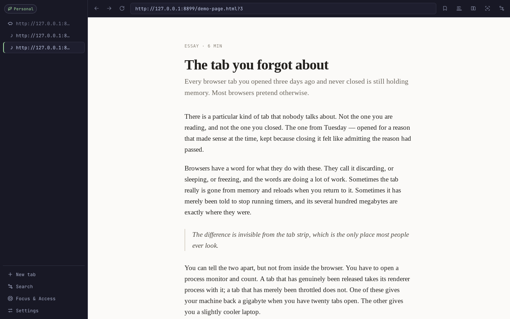
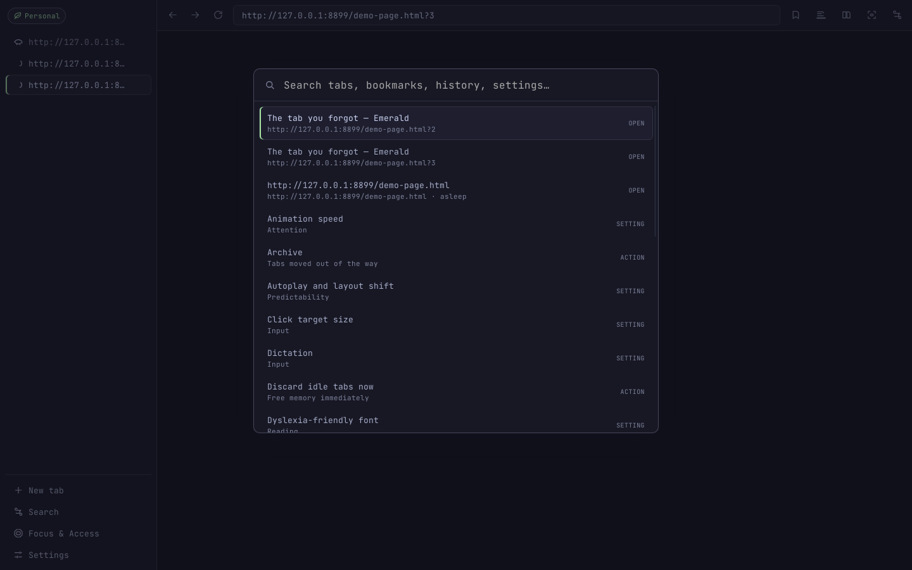
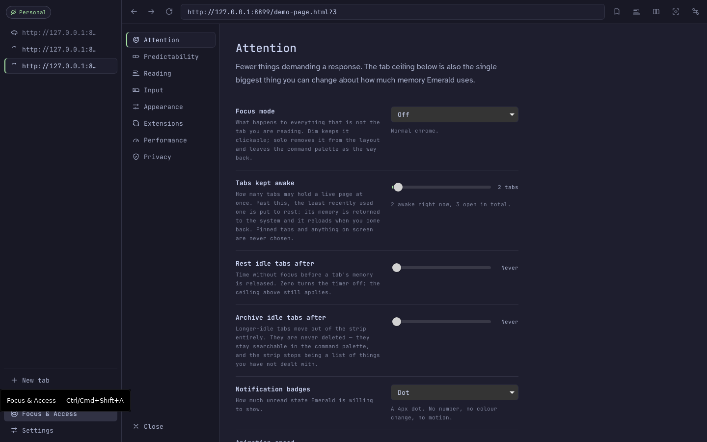
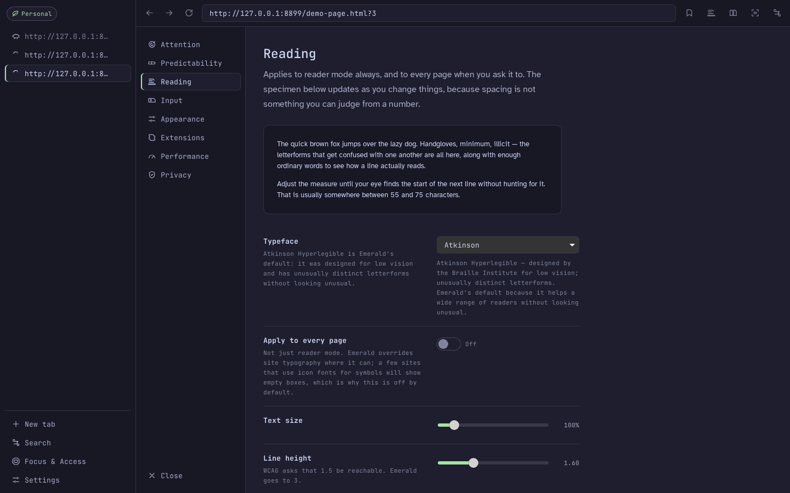
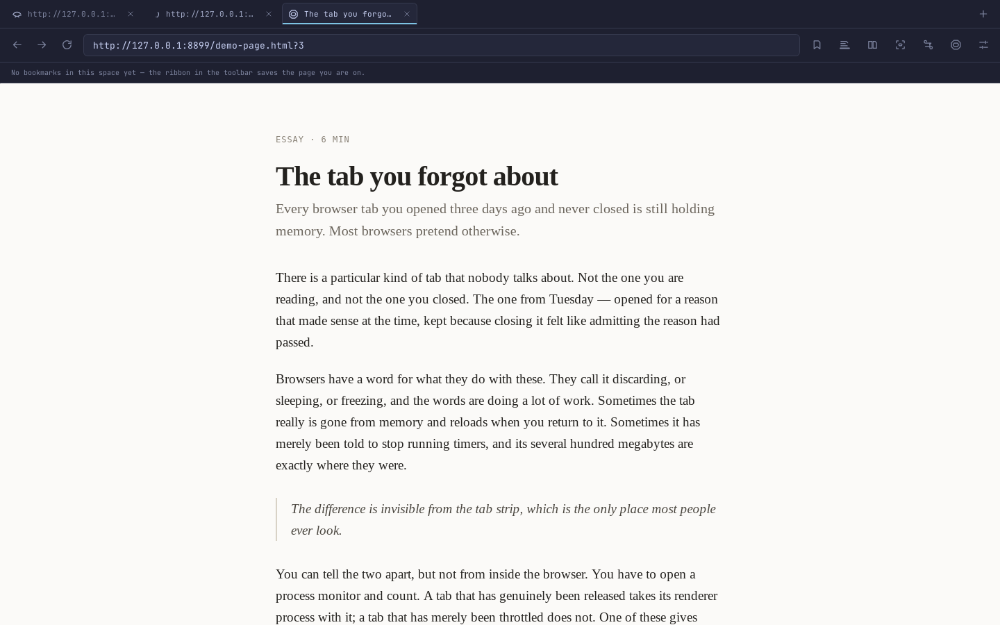

<div align="center">



# Emerald

**A calm, low-footprint web browser.**
Ships no rendering engine. Talks to nothing but the pages you open —
and one update check you can switch off.
Treats focus and accessibility as the product, not a panel you have to find.

</div>

---

## What this is

Emerald is a minimalist desktop browser built as a native Rust shell around the operating system's own web engine. It exists for three reasons, in this order:

1. **Feel calm.** Nothing flashes, autoplays, reorders itself, or moves the paragraph you are reading.
2. **Cost almost nothing to run.** No bundled engine, no background services, and a tab ceiling that genuinely returns memory to the OS rather than pretending to.
3. **Be usable by people whose brains don't work the "default" way.** The Focus & Access panel is first-class and reachable in one click or one keystroke from anywhere.

It is a working skeleton — the architecture, the design system, the settings model and the accessibility machinery are real and tested. [Known gaps are listed](docs/architecture.md#9-known-gaps) rather than glossed over.

**[emerald site →](https://zdstudios.github.io/Emerald/)** · **[Download →](https://github.com/ZDStudios/Emerald/releases/latest)**



<sup>The second tab is *resting*: its web process was terminated and its memory returned to the OS. It reloads when clicked.</sup>

<table>
<tr>
<td width="50%"></td>
<td width="50%"></td>
</tr>
<tr>
<td><sup>One index across tabs, archive, bookmarks, history, drafts and settings.</sup></td>
<td><sup>69 settings, each saying what it costs you as well as what it does.</sup></td>
</tr>
<tr>
<td width="50%"></td>
<td width="50%"></td>
</tr>
<tr>
<td><sup>Spacing is not a number you can judge, so the specimen is the control.</sup></td>
<td><sup>The Chrome-like preset: top tab strip, bookmarks bar, Macchiato theme.</sup></td>
</tr>
</table>

Screenshots are regenerated by `./scripts/screenshots.sh` — the demo page, window size and settings all live in the repo, so they are reproducible rather than curated.

## The engine, stated up front

| Platform | Engine | Chromium? |
| --- | --- | --- |
| Linux | WebKitGTK | No |
| macOS | WKWebView | No |
| **Windows** | **WebView2** | **Yes** |

Tauri has no non-Chromium Windows backend. That is a real gap and it is [documented, not hidden](docs/architecture.md#1-the-engine-decision-stated-plainly). Everything else works identically on all three.

## Install

Prebuilt installers for macOS, Windows and Linux are on the
[releases page](https://github.com/ZDStudios/Emerald/releases/latest).

**They are unsigned.** macOS will refuse to open the app on first launch — right-click it
and choose Open, or run `xattr -dr com.apple.quarantine /Applications/Emerald.app`.
Windows SmartScreen will warn; choose More info → Run anyway. Signing certificates cost
money this project does not have, and saying so up front beats letting you discover it.

| Platform | Download | Notes |
| --- | --- | --- |
| macOS (Apple silicon) | `Emerald_0.1.1_aarch64.dmg` | WebKit |
| macOS (Intel) | `Emerald_0.1.1_x64.dmg` | WebKit |
| Windows | `Emerald_0.1.1_x64-setup.exe` | Chromium (WebView2). Extensions work here |
| Windows (admins) | `Emerald_0.1.1_x64_en-US.msi` | Same build, for deployment tooling |
| Linux (Debian, Ubuntu) | `Emerald_0.1.1_amd64.deb` | needs `libwebkit2gtk-4.1` |
| Linux (anything else) | `Emerald_0.1.1_amd64.AppImage` | `chmod +x` it and run it |

The Windows `.exe` installs for the current user only, into `%LOCALAPPDATA%`. That is
deliberate: it means no administrator prompt to click through. The `.msi` is there for
anyone who needs a machine-wide install or has deployment tooling that expects one.

The `.app.tar.gz` files on the release are Tauri updater bundles, not something to
download. Emerald's update check (below) does not use them — it fetches the ordinary
installer — so they are inert. Take the `.dmg`.

One uneven thing worth knowing before you pick: the `.deb` installs Emerald's reading
typefaces system-wide, so the dyslexia font and reading face apply to **web page text**.
The other packages don't, so on those the same settings restyle Emerald's own interface
only. [Details and the fix](docs/architecture.md#9-known-gaps).

## Updates

Emerald asks GitHub once per window whether a newer release exists, and offers to
download the installer for your platform. It never replaces itself while running:
these builds are unsigned, so there is no signature to verify, and an unsigned
binary that silently swaps out an executable is a worse problem than a manual
click. Settings → Privacy → *Check GitHub for a newer Emerald* turns it off, and
with it off Emerald makes no request you did not ask for.

## Documentation

| Doc | What's in it |
| --- | --- |
| **[Architecture](docs/architecture.md)** | Engine decision and what it costs, tab lifecycle, the security model, every background process justified |
| **[Design language](docs/design-language.md)** | Palette semantics, type scale, spacing, motion rules, icon style guide |
| **[Settings schema](docs/settings-schema.md)** | Every option, generated from the Rust types that define them |
| **[Benchmarks](docs/benchmarks.md)** | Measured numbers, the method, and a same-machine Chromium baseline |

## Make it look like the browser you already use

Appearance → *Start from a familiar shape* has three presets. They set a handful of
options and get out of the way — nothing is hidden and everything stays editable.

| Preset | Tabs | Bookmarks bar |
| --- | --- | --- |
| **Emerald** | vertical sidebar | off |
| **Chrome-like** | horizontal strip, always-visible close buttons | on |
| **Bare** | none — palette only | off |

Four Catppuccin flavours (Mocha, Macchiato, Frappé, Latte), seven accents, three densities,
and `muted` / `high-contrast` sensory profiles that change how loud colour is without ever
changing what it means.

## Extensions

Honest answer: **Chrome extensions work on Windows and do not work on macOS or Linux.**
That is not a missing feature, it is the engine decision showing its price — WebView2 has a
Chrome extension system, WKWebView has none, and WebKitGTK's `extensions_path` loads
compiled `.so` modules that are a different technology with a confusingly similar name.

**Installing from the Chrome Web Store** works: open a listing and Emerald offers to
install it, fetching the package from the same update endpoint Chrome installs from. Worth
knowing what that is and is not — the Store serves `.crx` files under terms written for
Chrome-branded clients, and Emerald is not one. It does not impersonate Chrome, hold an
account, sync anything, or update extensions in the background. It is one download when
you ask for one. This was added on request; an earlier version of this README said Emerald
would never do it, and that is no longer true.

The prompt is drawn by the browser, never injected into the page, and the extension id
comes from the URL rather than from anything the page says — a Store listing is still a web
page, and a page that can draw a convincing "Install in Emerald" button can draw one
pointing somewhere else.

The two developer-mode routes also still work: install a `.crx` or `.zip` you downloaded,
or point at an unpacked folder. However it arrives, Emerald shows the extension's requested
permissions — host permissions flagged in the needs-attention hue — before you enable it,
and never loads extensions into its own interface, only into web pages.

## Build

Requires Rust 1.77+, Node 20+, pnpm.

```bash
# Linux only — the system engine and its headers
sudo apt install libwebkit2gtk-4.1-dev libgtk-3-dev librsvg2-dev \
                 libayatana-appindicator3-dev build-essential

pnpm install
./scripts/install-fonts.sh    # reading typefaces, installed system-wide
pnpm app:dev                  # run
pnpm app:build                # bundle
```

Building the binary with plain `cargo build --release` produces one that loads
its UI from the dev server rather than the bundle, and it does not warn you —
use `pnpm app:build`, or add `--features custom-protocol`.

Why fonts are installed rather than bundled into pages: a site's own Content-Security-Policy can block a web font the browser injects, which would make the dyslexia-friendly font fail silently on exactly the text-heavy sites where it matters. A locally installed family is outside CSP's reach.

## Check

```bash
pnpm check      # tsc --noEmit + cargo clippy -D warnings
cargo test      # 49 unit tests, in src-tauri/
pnpm schema     # regenerate the schema, TS types and settings doc
pnpm bench      # measure; see docs/benchmarks.md
```

`settings.rs` is the single source of truth for configuration. The JSON Schema, the TypeScript types, the panel's help text and the settings documentation are all generated from it, so they cannot drift. `scripts/check-generated.sh` fails if they are stale.

## Layout

```
src/                  chrome UI — Solid + TypeScript, 86KB bundled
  icons/index.tsx     the icon set: one file, one grid, one hand
  styles/tokens.css   the design system, three layers
  lib/settings.gen.ts GENERATED from settings.rs
src-tauri/src/
  runtime.rs          the only module that touches real webviews
  gtk_layout.rs       Linux: makes multi-webview positioning work at all
  tabs.rs             tab model + discard policy — pure, 13 tests
  settings.rs         the settings schema — single source of truth
  commands.rs         IPC, two permission tiers, checked twice
  inject.rs           builds the page content script
  metrics.rs          /proc memory accounting, no dependencies
assets/content/       the page runtime: a11y, drafts, reader, autoplay guard
schema/               GENERATED JSON Schema
bench/                benchmark harness + fixture pages
```

## Keyboard

| | |
| --- | --- |
| <kbd>Ctrl/⌘</kbd><kbd>K</kbd> | Command palette — tabs, archive, bookmarks, history, settings |
| <kbd>Ctrl/⌘</kbd><kbd>⇧</kbd><kbd>A</kbd> | **Focus & Access**, from anywhere |
| <kbd>Ctrl/⌘</kbd><kbd>E</kbd> | Cycle focus mode: off → dim → solo |
| <kbd>Ctrl/⌘</kbd><kbd>⇧</kbd><kbd>R</kbd> | Reader mode |
| <kbd>Ctrl/⌘</kbd><kbd>\\</kbd> | Split view |
| <kbd>Ctrl/⌘</kbd><kbd>T</kbd> / <kbd>W</kbd> / <kbd>L</kbd> / <kbd>R</kbd> | New tab / close / address bar / reload |
| <kbd>Ctrl/⌘</kbd><kbd>1</kbd>–<kbd>9</kbd> | Switch tab |

## What Emerald will not do

There is no setting for any of these, because there is no code for them:

- **No telemetry, crash reporting, update pings, or accounts.** Emerald opens the connections you ask it to and no others; even page prefetch is off by default.
- **Nothing in the interface flashes, blinks, pulses, or breathes** — in any theme, at any animation speed, for any reason. This is [enforced in CSS](src/styles/tokens.css), not left to discipline.
- **Colour meaning never moves.** Red is destructive, yellow is needs-attention, the accent is "yours". Changing theme or accent never changes what a colour means.

## Licence

MPL-2.0. Catppuccin palette (MIT). JetBrains Mono, Atkinson Hyperlegible and OpenDyslexic are each under the SIL Open Font License.
